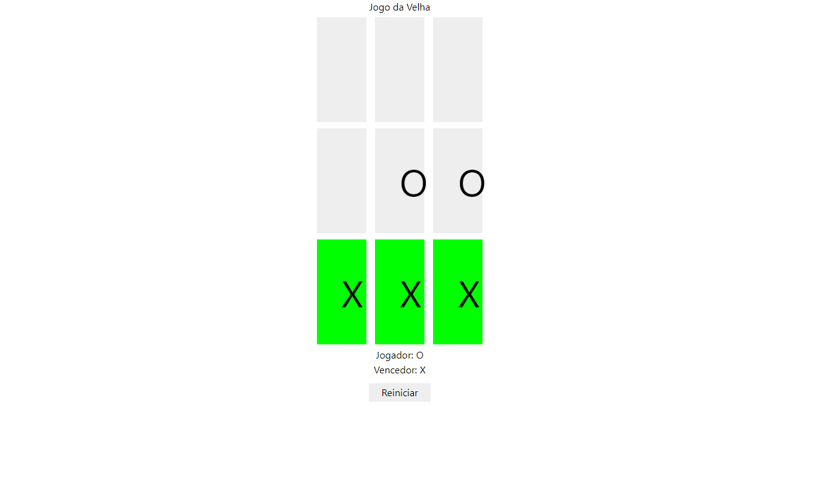

<div align="center">
  <h1>Jogo Velha</h1>
  <p>Este projeto apresenta a implementação de um Jogo da Velha interativo, desenvolvido com as tecnologias web HTML, CSS e JavaScript, visando estudos de logica de programação.</p>
  
</div>

# 📒 Índice
* [Descrição](#descrição)
* [Requisitos Funcionais](#requisitos)
* [Tecnologias](#tecnologias)
* [Design](#design)
  * [Cores](#cores)
  * [Fontes](#fontes)
* [Instalação](#instalação)
* [Licença](#licença)

# 📃 <span id="descrição">Descrição</span>
O objetivo é aplicar e aprofundar conhecimentos em lógica de programação, utilizando HTML para estruturar o conteúdo do jogo, CSS para estilizar e criar uma interface atraente, e JavaScript para adicionar interatividade e lógica de jogo.

# 📌 <span id="requisitos">Requisitos Funcionais</span>
- [x] Identificar jogador<br>
- [x] Identificar sequencias<br>
- [x] Validação de vencedor<br>
- [x] Opção para reiniciar partida<br>

# 💻 <span id="tecnologias">Tecnologias</span>
- **HTML**
- **CSS**
- **JavaScript**

# 🎨 <span id="design">Design</span>
- O modelo final para versão desktop e mobile está disponível na pasta `./design`

- <span id="cores">Cores<br></span>
  * #eee<br>
  * #0f0<br>

- <span id="fontes">Fontes<br></span>
  * Helvetica, Arial, sans-serif

# 🚀 <span id="instalação">Instalação</span>
```bash
  # Clone este repositório:
  $ git clone https://github.com/CleilsonAndrade/jogo_velha
  $ cd ./jogo_velha
```

# 📝 <span id="licença">Licença</span>
Esse projeto está sob a licença MIT. Veja o arquivo [LICENSE](LICENSE) para mais detalhes.

---

<p align="center">
  Feito com 💜 by CleilsonAndrade
</p>